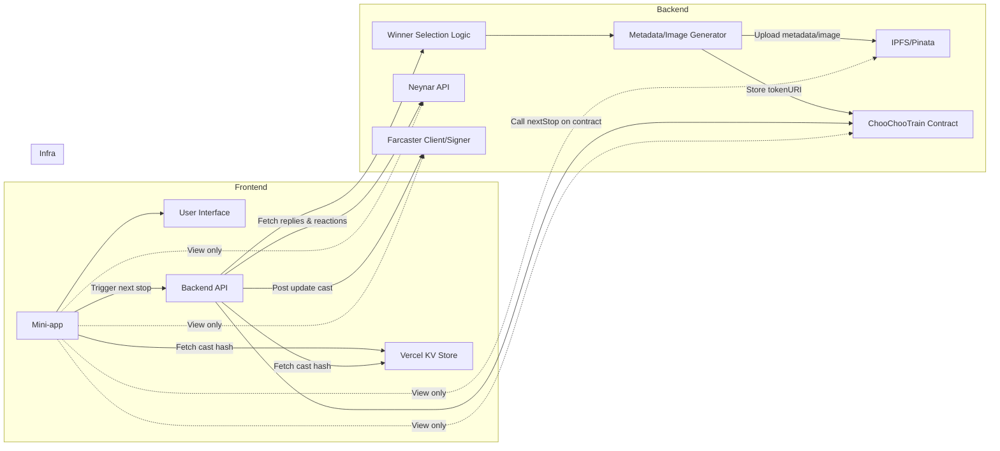

# Choo-Choo the Train

<p align="center">
  
</p>

Choo-Choo is more than a train, Choo-Choo is a social experiment on Base and Farcaster with a goal of visiting **every** active wallet on the Base network, including yours!

This project is an homage to [The Worm](https://theworm.wtf). Some say they can hear the ghost of The Worm as Choo-Choo puffs along the tracks.

- Art by: [@yonfrula](https://warpcast.com/yonfrula)
- Contracts by: [@jonbray.eth](https://warpcast.com/jonbray.eth)

## Getting Started

This project uses [pnpm](https://pnpm.io/) as the package manager and [Turborepo](https://turbo.build/) for orchestrating builds, tests, and scripts across the monorepo.

1. Install dependencies (from the root):

   ```bash
   pnpm install
   ```

2. Run monorepo-wide tasks (from the root):

   ```bash
   pnpm build      # Runs turbo build across all packages
   pnpm dev        # Runs turbo dev (if supported by packages)
   pnpm test       # Runs turbo test
   pnpm lint       # Runs turbo lint
   pnpm clean      # Cleans all build artifacts
   # ...and more, see package.json scripts
   ```

The root `package.json` contains scripts for orchestrating common tasks and ABI extraction, but each package (`contracts/`, `app/`) can also be managed individually with their own scripts.

> `pnpm` build pipeline will ensure latest contract ABI is available to the Farcaster mini-app.

### Directory Structure

```t
choo-choo-monorepo/
├── app/                # Farcaster mini-app
│   ├── abi/            # Contract ABIs
│   ├── environments/   # Environment configs (testnet, mainnet)
│   ├── public/
│   ├── src/
│   ├── ...
├── contracts/          # Foundry smart contracts
│   ├── src/            # Solidity contracts
│   ├── script/         # Deployment/interaction scripts
│   ├── test/           # Contract tests
│   ├── out/            # Foundry build output
│   ├── ...
├── scripts/            # Cross-project scripts
├── package.json        # Root package.json (pnpm workspaces, turbo scripts)
├── pnpm-workspace.yaml # pnpm workspace config
├── turbo.json          # Turborepo config
```

---

## System Architecture



**Flow Description:**

- The user who currently holds ChooChoo sends a cast via the **frontend**, and the cast hash is stored in **Vercel KV**.
- The **frontend** fetches the current cast hash from the **KV store** to know which cast to use for reply eligibility.
- When a user clicks "Next Stop", the **frontend** calls the **backend API**.
- The **backend**:
  - Fetches the current cast hash from the **KV Store**.
  - Fetches replies and reactions from **Neynar**.
  - Selects the winner (most reactions, valid wallet).
  - Generates NFT metadata and image.
  - Uploads metadata/image to **IPFS/Pinata**.
  - Calls the **ChooChooTrain Contract** to move the train and mint the ticket.
  - Posts an update cast to Farcaster using the **Farcaster Client/Signer** (e.g., ChooChoo account).
- The **Frontend** and users can view the journey, tickets, and contract state by reading from **IPFS/Pinata**, the **Contract**, and **Farcaster**.

---

## Smart Contract Design

### How does the `ChooChooTrain` contract work?

There is only one main train NFT (`tokenId: 0`) which can be transferred to new wallets using the `nextStop` function. When ChooChoo moves on to its next stop, the previous holder receives a "ticket" NFT as a souvenir (`tokenId > 0`).

Each ticket can have unique traits and image data, which are referenced by IPFS URLs/hashes and written off-chain.

> Tickets are standard ERC721 tokens and can be transferred.

### What if Choo-Choo goes to a dead wallet?

If the train gets stuck, previous passengers can "yoink" the train after a certain time:

- After **2 days** of no movement, the immediate previous passenger can yoink.
- After **3 days** any previous passenger can yoink.

---

### Traits & Image Generation

The app generates the full metadata for each ticket, including traits, image, and other fields, as a JSON object. This JSON is uploaded to IPFS, and the resulting IPFS hash/URL is written to the contract as the ticket's metadata (`tokenURI`).

```json
{
  "name": "ChooChooTrain Ticket #1",
  "description": "A stamped ChooChooTrain ticket.",
  "image": "ipfs://QmImageHash...",
  "attributes": [
    { "trait_type": "Paint Job", "value": "Red" },
    { "trait_type": "Face", "value": "Smile" },
    { "trait_type": "Mood", "value": "Stoned" }
  ]
}
```

---

### TicketData Struct & Convenience Setters

The contract includes a `TicketData` struct for each ticket, which stores:

- `tokenURI`: IPFS URL to the metadata JSON (for NFT marketplaces)
- `image`: IPFS URL to the image (optional, for convenience)
- `traits`: IPFS URL to a traits JSON (optional, for convenience)

These convenience fields allow offchain apps to access the image or traits directly from the contract, without needing to fetch and parse the metadata JSON.

### Trait Display

NFT marketplaces (OpenSea, Blur, etc.) call the `tokenURI(tokenId)` function for each token and receive the IPFS URL for the metadata JSON. The JSON is fetched and used to display the image, name, and traits (from the `attributes` array) in their UI.

### Minting Tickets with Custom Metadata

To mint a ticket with custom metadata, generate the full metadata JSON (including traits), upload it to IPFS, and call relevant contract functions using the resulting IPFS URL.

> Unlike The Worm, the contract does **not** perform any on-chain encoding or JSON assembly—all metadata is prepared off-chain and referenced by IPFS URL.

---

## Route Authentication

The `/api/next-stop` route is protected by Farcaster session-based authentication using NextAuth. Only users who are signed in with their Farcaster account (via the mini-app) can call this route.

Example:

```http
POST /api/next-stop
Content-Type: application/json

{
  "recipient": "0x...",
  "tokenURI": "ipfs://..."
}
```

If the user is not authenticated, the request will be rejected with a 401 error.
