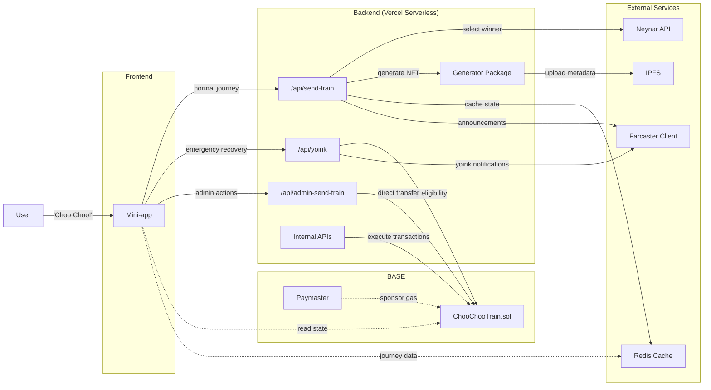

# Choo-Choo the Train

<p align="center">
  
</p>

Choo-Choo is more than a train, Choo-Choo is a social experiment on Base and Farcaster with a goal of visiting **every** active wallet on the Base network, including yours!

This project is an homage to [The Worm](https://theworm.wtf). Some say they can hear the ghost of The Worm as Choo-Choo puffs along the tracks.

- Art by: [@yonfrula](https://warpcast.com/yonfrula)
- Code by: [@jonbray.eth](https://warpcast.com/jonbray.eth)

## Getting Started

This project uses [pnpm](https://pnpm.io/) as the package manager and [Turborepo](https://turbo.build/) for orchestrating builds, tests, and scripts across the monorepo.

1. Install dependencies (from the root):

   ```bash
   pnpm install
   ```

2. Run monorepo-wide tasks (from the root):

   ```bash
   pnpm build      # Runs turbo build across all packages
   pnpm dev        # Runs turbo dev (if supported by packages)
   pnpm test       # Runs turbo test
   pnpm lint       # Runs turbo lint
   pnpm clean      # Cleans all build artifacts
   # ...and more, see package.json scripts
   ```

The root `package.json` contains scripts for orchestrating common tasks and ABI extraction, but each package (`contracts/`, `app/`) can also be managed individually with their own scripts.

> `pnpm` build pipeline will ensure latest contract ABI is available to the Farcaster mini-app.

### Directory Structure

```t
choo-choo-monorepo/
├── app/                # Farcaster mini-app (Next.js)
│   ├── abi/
│   ├── src/
├── contracts/          # Foundry smart contracts
│   ├── src/
│   ├── script/
│   ├── test/
├── generator/          # NFT Image & Metadata Generator
│   ├── layers/         # Raw PNG art layers
│   ├── src/            # Image composition & IPFS upload logic
├── scripts/            # Cross-project scripts
├── package.json
├── pnpm-workspace.yaml
├── turbo.json
```

---

## How ChooChoo Works

### The Journey System

ChooChoo is a unique NFT that travels between Farcaster users, creating a permanent record of its journey through ticket NFTs:

- **ChooChoo Train NFT (tokenId: 0)**: The main asset that moves between users
- **Journey Ticket NFTs (tokenId < 0)**: Minted to previous holders as proof of their ride
- **Current Holder**: Has the train and can send it to the next person
- **Previous Holders**: Received ticket NFTs and are part of ChooChoo's journey history

### Normal Journey Flow

1. **Current holder posts announcement**: User with ChooChoo posts a cast asking for the next passenger
2. **Community engagement**: Other users react to the cast to get in line for the next ride
3. **Winner selection**: Anyone can trigger the selection process after reactions accumulate
4. **Automatic transfer**: System selects a random winner from reactions, mints a ticket NFT to the previous holder, and transfers ChooChoo to the winner
5. **Social notification**: ChooChoo's official account posts a welcome message for the new holder

> The current holder can also choose to manually send ChooChoo to a Farcaster user of their choice, leaving the door open to unique social interactions and routes on ChooChoo's journey across BASE 🔵

### Yoink Feature (Emergency Recovery)

If ChooChoo gets stuck with an inactive holder, the community can recover it:

- **48-hour cooldown**: After 48 hours of no movement, anyone can "yoink" the train
- **Previous passenger protection**: Train cannot be yoinked to someone who has already been a passenger
- **Automatic processing**: Yoink follows the same flow as normal transfers (mints ticket, sends notifications)

### Admin Features

Designated admins can:

- **Set initial holder**: Set the initial current holder in Redis for a fresh mainnet deployment.
- **Direct send**: Send ChooChoo directly to any Farcaster user by FID, bypassing in-play mechanics while still preserving all of the mechanics for future stops.
- **Metadata management**: Update token metadata for any NFT (train or tickets) using IPFS hashes

## System Architecture



**Key API Endpoints:**

- `/api/send-train`: Orchestrates normal journey transfers from cast reactions
- `/api/yoink`: Handles emergency recovery of stuck trains (admin-only)
- `/api/admin-send-train`: Direct transfers by admin FID selection
- `/api/admin-set-ticket-data`: Admin metadata updates for any token
- `/api/current-holder`: Returns current train holder information
- `/api/journey`: Returns complete journey timeline with ticket data

---

## Smart Contract Design

### Core Mechanics

The `ChooChooTrain` contract manages the unique journey system:

- **Single train NFT**: Only one train (tokenId: 0) exists and moves between holders
- **Journey tickets**: Previous holders receive unique ticket NFTs with custom metadata
- **Admin controls**: Designated admins can execute transfers and emergency recovery
- **Time-based recovery**: Built-in yoink mechanism prevents permanent sticking

### Key Functions

- `nextStop(address to)`: Admin function to move train and mint ticket to previous holder
- `nextStopWithTicketData(address to, string memory tokenURI, string memory image, string memory traits)`: Combined transfer with metadata setting
- `yoink(address to)`: Emergency recovery after 48-hour cooldown (admin-only)
- `isYoinkable()`: Returns eligibility status and reason for yoink attempts
- `setTicketData(uint256 tokenId, ...)`: Update metadata for ticket NFTs
- `setMainTokenURI(string memory _mainTokenURI)`: Update train NFT metadata (owner-only)

### Safety Features

- **Previous passenger protection**: Cannot send train to someone who already has a ticket
- **Admin whitelist**: Only designated addresses can execute transfers
- **Time-based recovery**: Prevents permanent sticking with timed yoink eligibility
- **Metadata flexibility**: Admins can update any token's metadata post-mint

---

## NFT Metadata & Generation

### Automated Generation

The `generator` package creates unique ticket metadata:

```json
{
  "name": "ChooChooTrain Ticket #1",
  "description": "A stamped ChooChooTrain ticket.",
  "image": "ipfs://QmImageHash...",
  "attributes": [
    { "trait_type": "Paint Job", "value": "Red" },
    { "trait_type": "Face", "value": "Smile" },
    { "trait_type": "Mood", "value": "Stoned" }
  ]
}
```

### Metadata Storage

The contract stores convenience data for each ticket:

- `tokenURI`: Full IPFS URL to metadata JSON (standard ERC-721)
- `image`: Direct IPFS URL to image (for quick access)
- `traits`: IPFS URL to traits JSON (for filtering/search)

### IPFS Integration

- **Pinata**: Uploads images and metadata to IPFS
- **Automatic prefixing**: System handles `ipfs://` URL formatting
- **Admin updates**: Metadata can be updated post-mint for corrections

---

## Authentication & Security

### Farcaster Integration

- **NextAuth.js**: Handles Farcaster authentication via Neynar
- **Session management**: User sessions tied to Farcaster FID
- **Address verification**: Links Farcaster accounts to verified Ethereum addresses

### Admin Access Control

- **FID whitelist**: Only specific Farcaster FIDs can access admin functions
- **Smart contract admins**: Contract-level admin addresses for transaction execution
- **Internal API protection**: Backend routes secured with internal secrets

### Gas Sponsorship

- **Paymaster integration**: Users don't pay gas for train movements
- **Admin-funded**: Admin private key pays for all contract interactions
- **Base network**: Optimized for low-cost transactions

---

## Development & Deployment

### Local Development

```bash
# Install dependencies
pnpm install

# Start development servers
pnpm dev

# Run tests
pnpm test

# Build for production
pnpm build
```

### Contract Development

```bash
# Navigate to contracts
cd contracts/

# Run tests
forge test

# Deploy (with environment setup)
forge script script/Deploy.s.sol --broadcast

# Copy ABI to app
cd .. && pnpm run copy-abi
```

### Environment Variables

```bash
# Core API Keys
NEYNAR_API_KEY=your_neynar_api_key
PINATA_JWT=your_pinata_jwt_token
CHOOCHOO_SIGNER_UUID=your_choochoo_signer_uuid

# Smart Contract
NEXT_PUBLIC_CHOOCHOO_TRAIN_ADDRESS=0x...
ADMIN_PRIVATE_KEY=0x...

# Internal Security
INTERNAL_SECRET=your_internal_secret
NEXTAUTH_SECRET=your_nextauth_secret

# Database
REDIS_URL=your_redis_url
```

All aboard!
