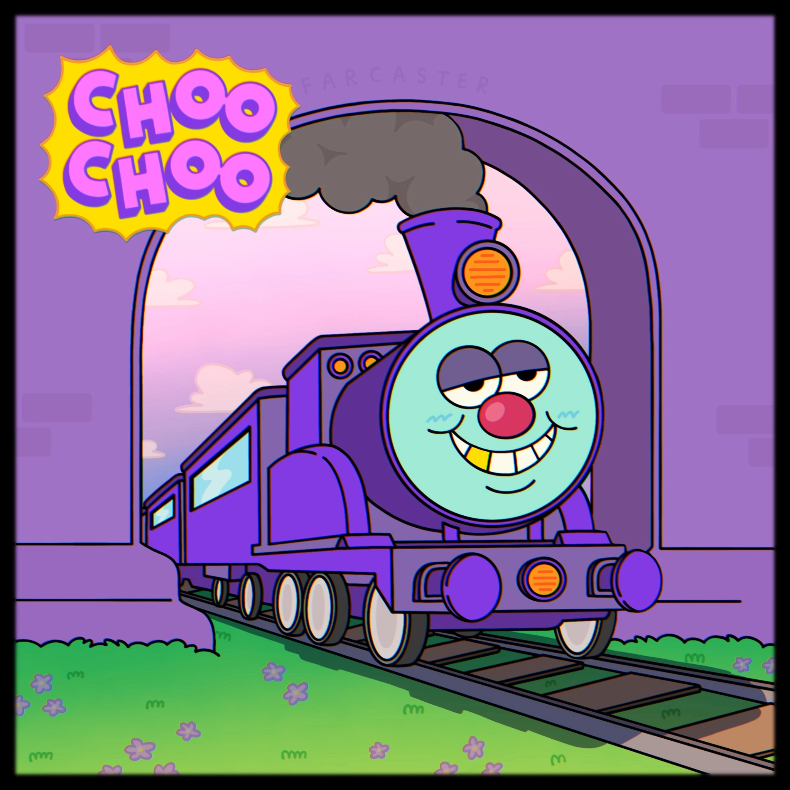
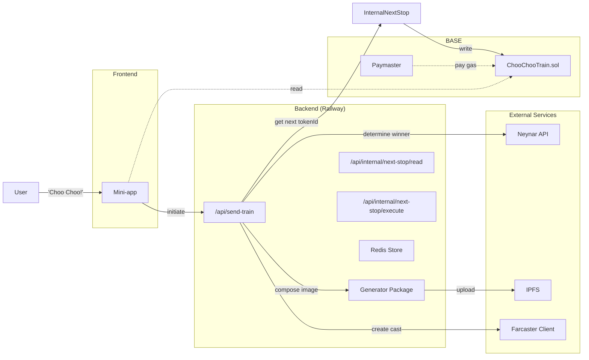

# Choo-Choo the Train

<p align="center">
  
</p>

Choo-Choo is more than a train, Choo-Choo is a social experiment on Base and Farcaster with a goal of visiting **every** active wallet on the Base network, including yours!

This project is an homage to [The Worm](https://theworm.wtf). Some say they can hear the ghost of The Worm as Choo-Choo puffs along the tracks.

- Art by: [@yonfrula](https://warpcast.com/yonfrula)
- Code by: [@jonbray.eth](https://warpcast.com/jonbray.eth)

## Getting Started

This project uses [pnpm](https://pnpm.io/) as the package manager and [Turborepo](https://turbo.build/) for orchestrating builds, tests, and scripts across the monorepo.

1. Install dependencies (from the root):

   ```bash
   pnpm install
   ```

2. Run monorepo-wide tasks (from the root):

   ```bash
   pnpm build      # Runs turbo build across all packages
   pnpm dev        # Runs turbo dev (if supported by packages)
   pnpm test       # Runs turbo test
   pnpm lint       # Runs turbo lint
   pnpm clean      # Cleans all build artifacts
   # ...and more, see package.json scripts
   ```

The root `package.json` contains scripts for orchestrating common tasks and ABI extraction, but each package (`contracts/`, `app/`) can also be managed individually with their own scripts.

> `pnpm` build pipeline will ensure latest contract ABI is available to the Farcaster mini-app.

### Directory Structure

```t
choo-choo-monorepo/
├── app/                # Farcaster mini-app (Next.js)
│   ├── abi/
│   ├── src/
├── contracts/          # Foundry smart contracts
│   ├── src/
│   ├── script/
│   ├── test/
├── generator/          # NFT Image & Metadata Generator
│   ├── layers/         # Raw PNG art layers
│   ├── src/            # Image composition & IPFS upload logic
├── scripts/            # Cross-project scripts
├── package.json
├── pnpm-workspace.yaml
├── turbo.json
```

---

## System Architecture



**Flow Description:**

- The user who currently holds ChooChoo clicks the "Send Train" button in the **frontend mini-app**.
- The frontend calls the `/api/send-train` **backend API endpoint**.
- The `/api/send-train` endpoint orchestrates the entire flow:
  1.  Fetches replies and reactions from **Neynar** to determine the winning user.
  2.  Calls the internal `/api/internal/next-stop/read` endpoint to get the current `totalSupply` for the next `tokenId`.
  3.  Invokes the **`generator` package** to compose a unique NFT image from the art layers.
  4.  The **`generator` package** uploads the new image and the final metadata to **IPFS/Pinata**.
  5.  The orchestrator calls the internal `/api/internal/next-stop/execute` endpoint with the winner's address and the new `tokenURI`.
  6.  The internal endpoint executes the transaction on the **ChooChooTrain Contract** to move the train and mint the ticket.
  7.  (Optional) Posts an update cast to Farcaster via the **Farcaster Client/Signer**.

@todo: add failure handling

---

## Deployment

The application is deployed to [Railway](https://railway.app/) with Redis for caching and session management. The deployment uses a standalone Next.js server optimized for monorepo environments.

### Production Build Flow

1. `turbo build` (root) → builds both workspaces
2. `pnpm --filter=generator build` → compiles Solidity <-> TypeScript code-gen
3. `pnpm --filter=app build` → runs `next build` with standalone output
4. `pnpm --filter=app postbuild` → copies static assets to standalone directory
5. Railway launches `npm start` → executes `node .next/standalone/app/server.js`

### Railway Configuration

| Environment Variable | Value | Purpose |
|---------------------|-------|---------|
| `PORT` | `3000` (auto-injected) | Next.js standalone server port |
| `HOSTNAME` | `0.0.0.0` | Ensures server binds on all interfaces |
| `REDIS_PUBLIC_URL` | Railway Redis URL | Redis connection (uses IPv6) |

Additional app-specific variables include Neynar API keys, contract addresses, and IPFS configuration.

### Redis Integration

The application uses Redis for:
- Caching train state and winner determination
- Session management for Farcaster authentication
- Rate limiting and temporary data storage

Railway's Redis instance is configured to use the public URL due to IPv6 networking requirements. The connection is managed through `ioredis` instead of the Upstash client used in development.

### Monorepo Deployment Challenges

Several modifications were required to deploy the monorepo successfully:

- **Generator Package**: Added explicit build step to ensure image generation works in production
- **External Dependencies**: Configured `imagescript` as external to webpack to avoid bundling native bindings
- **Standalone Output**: Used Next.js standalone mode to create a self-contained server
- **Asset Management**: Custom `postbuild` script copies static assets to the correct location
- **Non-interactive Builds**: Modified Neynar SDK build process to avoid CI hanging on prompts

### Health Monitoring

The deployment includes a health check endpoint at `/api/health` that:
- Returns 200 status when the application is running
- Provides Redis connection status
- Enables Railway's health monitoring

### Build Commands

```bash
# Production deployment
pnpm install --frozen-lockfile
pnpm run build:production
pnpm start  # Delegates to app's standalone server
```

For detailed deployment configuration and troubleshooting, see `docs/DEPLOYMENT_GUIDE.md`.

---

## Smart Contract Design

### How does the `ChooChooTrain` contract work?

There is only one main train NFT (`tokenId: 0`) which can be transferred to new wallets using the `nextStop` function. When ChooChoo moves on to its next stop, the previous holder receives a "ticket" NFT as a souvenir (`tokenId > 0`).

Each ticket can have unique traits and image data, which are referenced by IPFS URLs/hashes and written off-chain.

> Tickets are standard ERC721 tokens and can be transferred.

### What if Choo-Choo goes to a dead wallet?

If the train gets stuck, previous passengers can "yoink" the train after a certain time:

- After **2 days** of no movement, the immediate previous passenger can yoink.
- After **3 days** any previous passenger can yoink.

---

### Traits & Image Generation

The app's `generator` package generates the full metadata for each ticket, including traits, image, and other fields, as a JSON object. This JSON is uploaded to IPFS, returning the CID, and the resulting IPFS URL is written to the contract as the ticket's metadata (`tokenURI`).

```json
{
  "name": "ChooChooTrain Ticket #1",
  "description": "A stamped ChooChooTrain ticket.",
  "image": "ipfs://QmImageHash...",
  "attributes": [
    { "trait_type": "Paint Job", "value": "Red" },
    { "trait_type": "Face", "value": "Smile" },
    { "trait_type": "Mood", "value": "Stoned" }
  ]
}
```

---

### TicketData Struct & Convenience Setters

The contract includes a `TicketData` struct for each ticket, which stores:

- `tokenURI`: IPFS URL to the metadata JSON (for NFT marketplaces)
- `image`: IPFS URL to the image (optional, for convenience)
- `traits`: IPFS URL to a traits JSON (optional, for convenience)

These convenience fields allow offchain apps to access the image or traits directly from the contract, without needing to fetch and parse the metadata JSON.

### Trait Display

NFT marketplaces (OpenSea, Blur, etc.) call the `tokenURI(tokenId)` function (as outlined by [ERC-721](https://eips.ethereum.org/EIPS/eip-721)) for each token and receive the IPFS CID for the metadata JSON. The JSON is fetched and used to display the image, name, and traits (from the `attributes` array) in their UI.

### Minting Tickets with Custom Metadata

To mint a ticket with custom metadata, generate the full metadata JSON (including traits), upload it to IPFS, and call the relevant contract functions using the resulting IPFS CID.

> Unlike The Worm, the contract does **not** perform any on-chain encoding or JSON assembly—all metadata is prepared off-chain and referenced by IPFS CID.

## Route Authentication

The `/api/send-train` route is the primary endpoint for orchestrating the train's movement. It can be called by any user to initiate the process.

The `/api/internal/next-stop/read` and `/api/internal/next-stop/execute` routes are protected, internal-only endpoints that handle direct interaction with the smart contract. They can only be called by other backend services that provide the correct `INTERNAL_SECRET`. This prevents unauthorized users from directly reading contract state or executing transactions to move the train.
