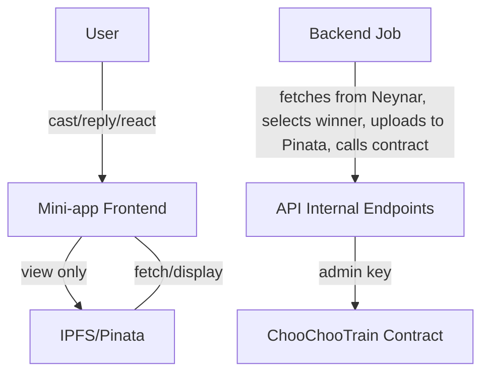

# ChooChoo Journey: System Docs

This document describes how ChooChoo moves using a backend-orchestrated process for calling the `nextStop` method on the ChooChooTrain contract. The process of selecting the next recipient, generating and pinning NFT metadata and images, and triggering the contract call are automated based on Farcaster data.

> For a streamlined UX, the process is triggered by backend logic, not user actions.

---

## Flow Description

### User Interaction

1. Users create a cast using the mini-app that says ChooChoo is looking for it's next destination. This begins a countdown to ChooChoo leaving the station.
2. Other users reply to the cast.
3. The reply with the most reactions (likes + recasts) will be the one to receive ChooChoo.

> **Note:** The frontend is responsible for sending out a cast and displaying the NFT journey, but does not trigger the backend orchestration.

### Backend Orchestration

- After a set period, a backend job (cron, serverless function, or webhook) is triggered.
- The backend fetches all replies and reactions to the cast using the Neynar API.
- The backend determines the winner (the user whose reply received the most reactions).
- The backend composes the NFT image and metadata (name, description, attributes).
- The backend uploads the image and metadata to IPFS via Pinata using the `/api/pinata/mint` internal endpoint.
- The backend then calls the `/api/next-stop` internal endpoint, passing the winner's address and the tokenURI (IPFS CID for the metadata). This endpoint uses the admin key to move the train NFT on-chain.

💡 @todo use CDP paymaster instead of ADMIN_PRIVATE_KEY

### Frontend Display

Users can view the train's journey, ticket NFTs, and cast history, but cannot directly trigger the backend orchestration or contract calls.

---

## Code Overview

### API Routes

- **`/api/pinata/mint`**: Handles image and metadata uploads to Pinata. Only accessible by backend jobs or authorized sessions. Returns the tokenURI and image CID.
- **`/api/next-stop`**: Internal-only endpoint. Only callable by backend jobs/services with the correct internal secret. Calls the contract's `nextStop` function using the admin key. Does not accept requests from the frontend or users.

### Backend Orchestration Script

- **`scripts/orchestrateNextStop.ts`**: The main backend job that:
  - Fetches cast data and reactions from Neynar.
  - Selects the winner.
  - Composes and uploads NFT image and metadata.
  - Calls the internal endpoints to mint the NFT and move the train.
  - Handles all sensitive logic and secrets.

### React Hooks

- **`useChooChoo.ts`**: Centralizes blockchain contract logic for the frontend (read/write, status, etc.).
- **`useFetchFromPinata.ts`**: Fetches and formats NFT metadata from Pinata/IPFS for frontend display.
- **`useNextStopFlow.ts`**: Orchestrates the minting and contract call from the frontend. This is **not** initially exposed in the mini-app and is used for manually sending ChooChoo to a recipient address.

### Frontend Components

- **`NFTDisplay.tsx`**: Displays NFT image and metadata from IPFS.
- **`TrainJourney.tsx`**: Shows the journey/history of the train.
- **`AdminModal.tsx`**: Allows admin to manually trigger the backend flow for testing.

---

## Security

- Sensitive endpoints (`/api/next-stop`, `/api/pinata/mint`) are protected and only callable by backend jobs or authorized sessions.
- Admin keys and Pinata secrets are never exposed to the frontend.

---

## System Architecture Diagram

---

## @todo

- [ ] **Scheduler:** Implement a robust scheduler (cron or webhook) to trigger the backend orchestration at the correct time after each cast.
- [ ] **Image Composition:** randomly compose the NFT using completed traits.
- [ ] **Frontend Enhancements:** Build out the journey and NFT display components.
- [ ] **Admin Tools:** (Optional) Add admin UI for manual triggers.
- [ ] **Testing:** E2E tests for the full orchestration flow.

---
