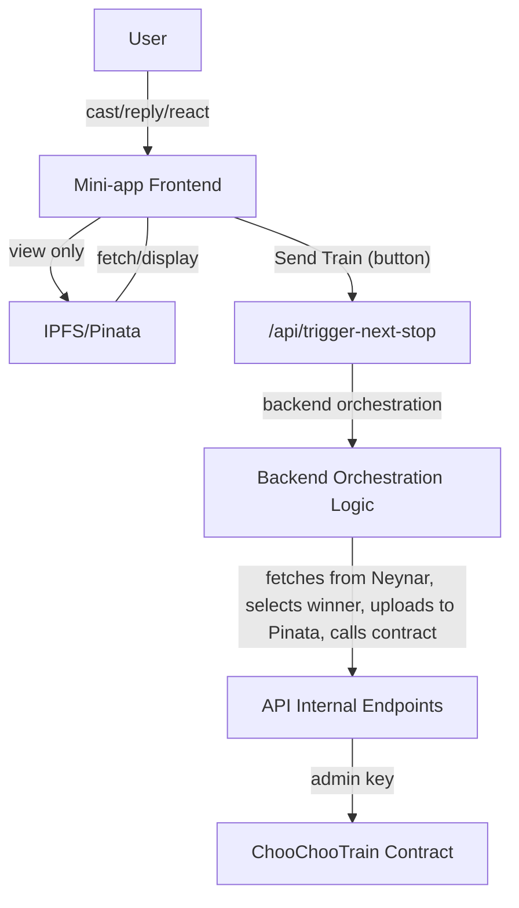

# ChooChoo Journey: System Docs

This document describes how ChooChoo moves using a user-triggered backend-orchestrated process for calling the `nextStop` method on the ChooChooTrain contract. The process of selecting the next recipient, generating and pinning NFT metadata and images, and triggering the contract call is initiated by the user who currently holds the train NFT via the mini-app.

---

## Flow Description

### User Interaction

1. Users create a cast using the mini-app that says ChooChoo is looking for its next destination.
2. Other users reply to the cast.
3. The reply with the most reactions (likes + recasts) will be the one to receive ChooChoo.
4. The current holder sees a "Send Train" button in the mini-app and clicks it to trigger the nextStop flow.

### Backend Orchestration

- When the current holder clicks the button, the frontend calls a backend endpoint to start the nextStop flow.
- The backend fetches all replies and reactions to the cast using the Neynar API.
- The backend determines the winner (the user whose reply received the most reactions).
- The backend composes the NFT image and metadata (name, description, attributes).
- The backend uploads the image and metadata to IPFS via Pinata using the `/api/pinata/mint` internal endpoint.
- The backend then calls the `/api/next-stop` internal endpoint, passing the winner's address and the tokenURI (IPFS CID for the metadata). This endpoint uses the admin key to move the train NFT on-chain.

💡 @todo use CDP paymaster instead of ADMIN_PRIVATE_KEY

### Frontend Display

- Users can view the train's journey, ticket NFTs, and cast history.
- The current holder is shown the "Send Train" button when eligible.
- The frontend does not directly call the contract, but triggers the backend orchestration.

---

## Code Overview

### API Routes

- **`/api/pinata/mint`**: Handles image and metadata uploads to Pinata. Only accessible by backend jobs or authorized sessions. Returns the tokenURI and image CID.
- **`/api/next-stop`**: Internal-only endpoint. Only callable by backend jobs/services with the correct internal secret. Calls the contract's `nextStop` function using the admin key. Does not accept requests from the frontend or users.
- **`/api/trigger-next-stop`**: Called by the frontend when the current holder clicks "Send Train". Authenticates the user, verifies they are the current holder, and triggers the backend orchestration logic.

### Backend Orchestration Script

- **`scripts/orchestrateNextStop.ts`**: The main backend job that:
  - Fetches cast data and reactions from Neynar.
  - Selects the winner.
  - Composes and uploads NFT image and metadata.
  - Calls the internal endpoints to mint the NFT and move the train.
  - Handles all sensitive logic and secrets.
  - Can be called by `/api/trigger-next-stop`.

### React Hooks

- **`useChooChoo.ts`**: Centralizes blockchain contract logic for the frontend (read/write, status, etc.).
- **`useFetchFromPinata.ts`**: Fetches and formats NFT metadata from Pinata/IPFS for frontend display.
- **`useNextStopFlow.ts`**: Orchestrates the minting and contract call from the frontend. Used to trigger the backend orchestration when the current holder clicks the button.

### Frontend Components

- **`NFTDisplay.tsx`**: Displays NFT image and metadata from IPFS.
- **`TrainJourney.tsx`**: Shows the journey/history of the train.
- **`SendTrainButton.tsx`**: Displays the "Send Train" button to the current holder and triggers the backend orchestration.
- **`AdminModal.tsx`**: Allows admin to manually trigger the backend flow for testing.

---

## Security

- Sensitive endpoints (`/api/next-stop`, `/api/pinata/mint`) are protected and only callable by backend jobs or authorized sessions.
- `/api/trigger-next-stop` is protected by session-based authentication and verifies the user is the current holder before triggering the backend orchestration.
- Admin keys and Pinata secrets are never exposed to the frontend.

---

## System Architecture Diagram

---

## @todo

- [ ] **Scheduler:** (Optional) Implement a scheduler to remind the current holder when it's time to send the train.
- [ ] **Image Composition:** Randomly compose the NFT using completed traits.
- [ ] **Frontend Enhancements:** Build out the journey, NFT display, and "Send Train" button components.
- [ ] **Admin Tools:** (Optional) Add admin UI for manual triggers.
- [ ] **Testing:** E2E tests for the full orchestration flow.
- [ ] **/api/trigger-next-stop:** Implement endpoint to authenticate, verify current holder, and trigger orchestration.

---
